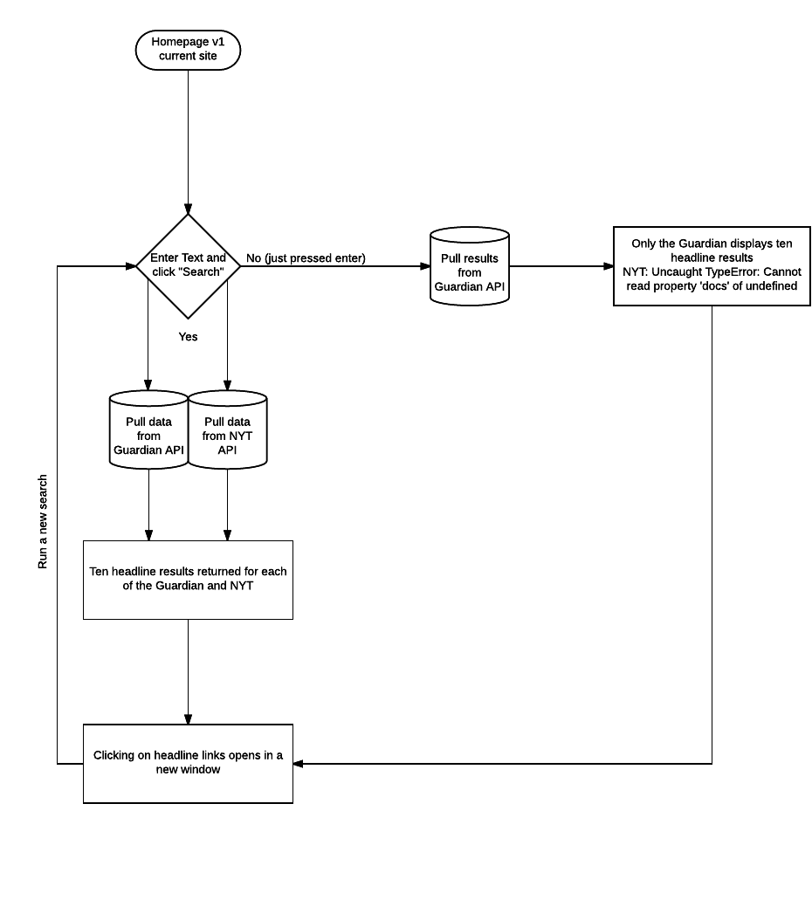
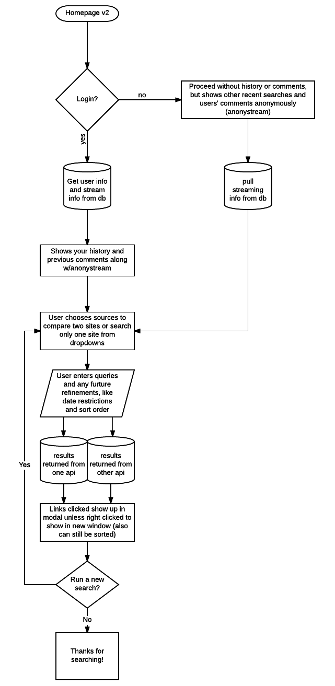

*Description of processes such as routing to be rewritten upon update after class. See duplicate readme for old description.*

**User Stories**

As a user, I would like to be able to search a news subject and compare how different news sources produce headlines. Since Brexit is all over the international media right now, it would be great to see how two papers of record report on such subjects and, especially, to be able to compare the headlines that are generated in the US vs the UK. I would like to enter one search term and see a justoposition of the results. That's all I want--for now.

	Current Flow Chart

	Flow Chart v2 (for future--to be updated for portfolio and personal use)

	Old wireframe

**API Keys and Developer Tokens--acquired**

http://open-platform.theguardian.com/access/

http://developer.nytimes.com/

https://developer.feedly.com/
